# Auqa Smooth Normals - Improved Outline Documentation

Tnanks again for downloading the asset.

**Auqa Smooth Normals** is used to solve the problem of stroke breakage due to unsmooth model normals in **runtime** or **editor**. 

By default, Auqa Smooth Normals stores the repaired normals in the model's uv8, you can very simply integrate it into the shader of your project, and there is a simple outline shader in the package. 

You are welcome to ask your questions to email address:

dumoedss@gmail.com

You can follow the below steps to set up the asset. Good luck!

## Install

**AquaSmoothNormals** depends  on  **Jobs** package, so you need to install **Jobs**.

1. Open the menu **Window/Package Manager**

   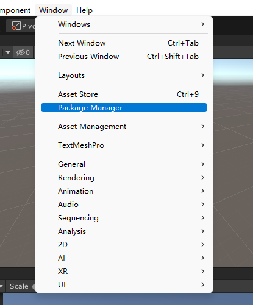

2. Select **UnityRegistry**

   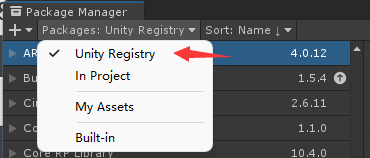

3. **Enable Preview Packages**

   1. If your Unity Version is 2019:

      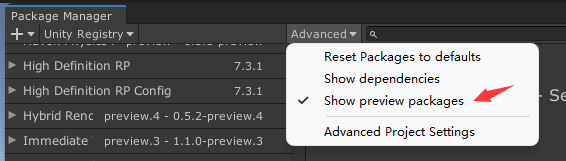

   2. If your Unity Version is higher than 2019:

      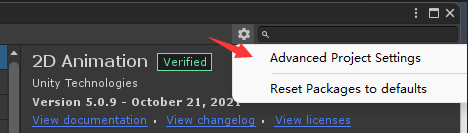

      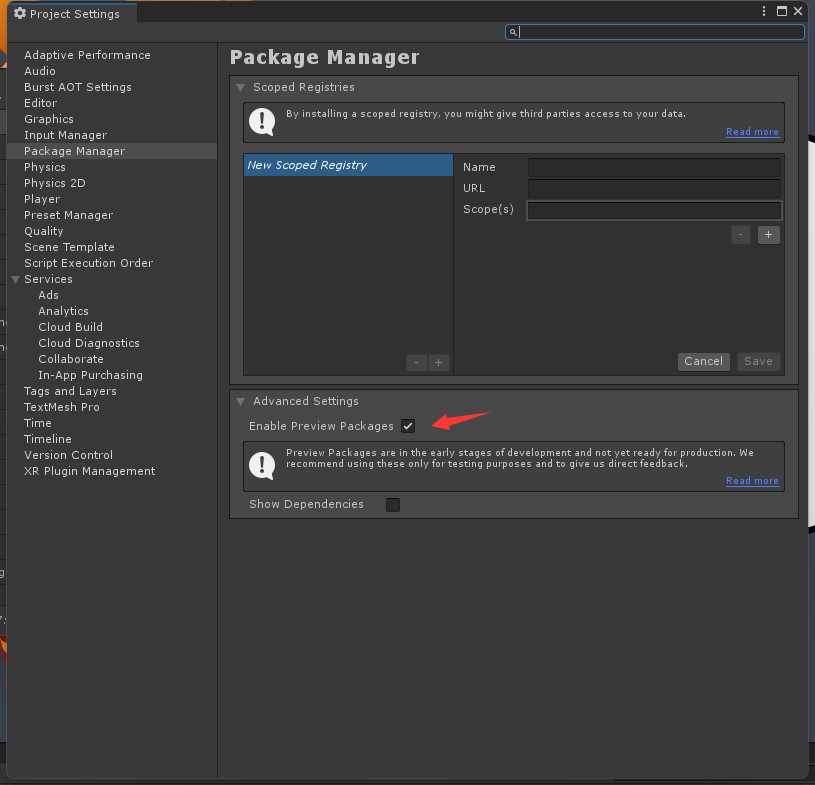

4. Find and Install **Jobs**:

   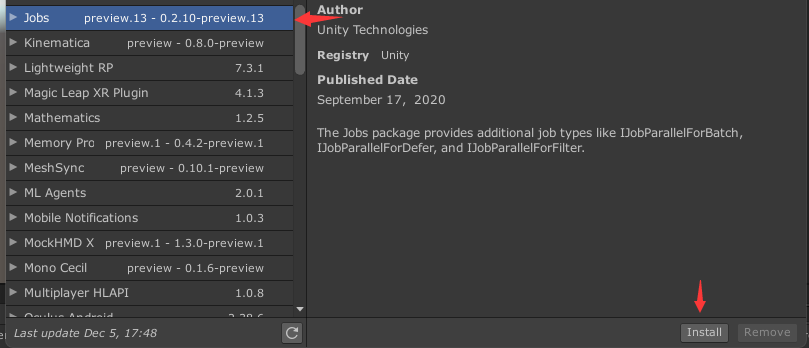


## How to use

### Shader

There is a simple outline shader in the package, you can refer to it to rewrite your shader, the core part is to change the source of normal from model's normal to baked normal in the outline shader. By default, **Auqa Smooth Normals** stores the repaired normals in the model's uv8, you can very simply integrate it into the shader of your project,

```
struct appdata
{
	float4 vertex : POSITION;
	//original mesh normals
	float3 normal:NORMAL;
	float4 tangent:TANGENT;
	float2 uv : TEXCOORD0;
	//baked smoothed normals
	float2 bakedNormal:TEXCOORD7;
};

//Unpack normals and Transform normals from TangentSpace to ObjectSpace
float3 TransformTBN(float2 bakedNormal, float3x3 tbn)
{
	float3 normal = float3(bakedNormal, 0);	
	normal.z = sqrt(1.0 - saturate(dot(normal.xy, normal.xy)));
	return  (mul(normal, tbn));
}

//Vertex Shader
v2f vert(appdata v)
{
	v2f o;
	o.uv = TRANSFORM_TEX(v.uv, _MainTex);
	
	//Get TangentSpace to ObjectSpace Matrix
	float3 normalOS = normalize(v.normal);
	float3 tangentOS = v.tangent;
	tangentOS = normalize(tangentOS);
	float3 bitangentOS = normalize(cross(normalOS, tangentOS) * v.tangent.w);
	float3x3 tbn = float3x3(tangentOS, bitangentOS, normalOS);
	
	//Get smoothed normals
	float3 _BakedNormalDir = (TransformTBN(v.bakedNormal, tbn));
	
	//Outline
	float4 pos = UnityObjectToClipPos(v.vertex);
	float Set_OutlineWidth = pos.w * _OutlineWidth;
	Set_OutlineWidth = min(Set_OutlineWidth, _OutlineWidth);
	Set_OutlineWidth = min(Set_OutlineWidth, _OutlineWidth) * 0.001;
	
	//Use original normals or smoothed normals
	float3 Set_NormalDir = lerp(v.normal, _BakedNormalDir, _Is_BakedNormal);
	o.pos = UnityObjectToClipPos(v.vertex + Set_NormalDir * Set_OutlineWidth);
	return o; 
}
```

### Runtime

You can generate smoothed normals for mesh just by one method in runtime. Due to the **Jobs** bonus, the generation speed is very fast.

The method define is:

```
Vector2[] SmoothNormals.ComputeSmoothedNormals(Mesh mesh);
```

And you can use it as follows, it will It will store the smoothed normals into the uv8 of the model.

(It should be noted that the first parameter of SetUvs is the number of uv channels, starting from 0 and ending at 7, representing uv1 to uv8 of the model respectively)

```
mesh.SetUVs(7, SmoothNormals.ComputeSmoothedNormals(mesh));
```

### Editor

You can open the editor window through the menu Tools/SmoothNormals, generate smooth normals and save them to the model, after saving, you can see UV8 in the window of the mesh.

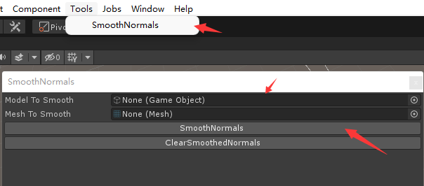

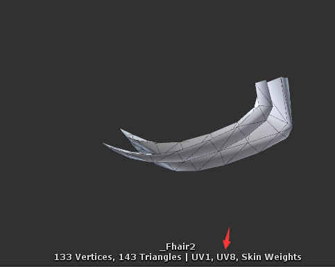

Also you can write model import script to generate smoothed normals and save them to the model when the model is imported.

Here is an example, when you put the model into the folder with **SmoothNormals**, the model normals are automatically generated and saved to UV8.

```
public class SmoothNormalsMeshImporter : AssetPostprocessor
    {
        void OnPostprocessModel(GameObject root)
        {
            if (assetPath.Contains("SmoothNormals"))
            {
                var meshes = Utils.GetMesh(root);

                foreach (var mesh in meshes)
                {
                    mesh.SetUVs(7, SmoothNormals.ComputeSmoothedNormals(mesh));
                }
            }
        }
    }
```


## Showcase

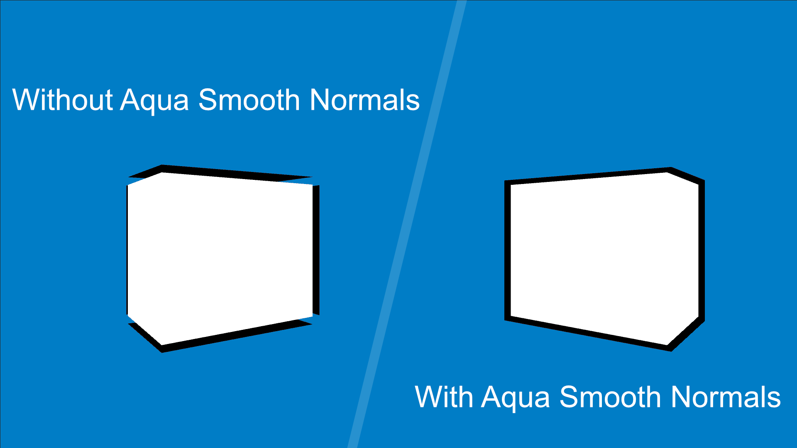

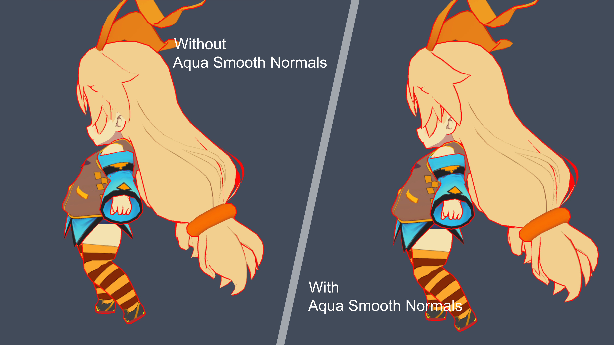

OriginNormals:

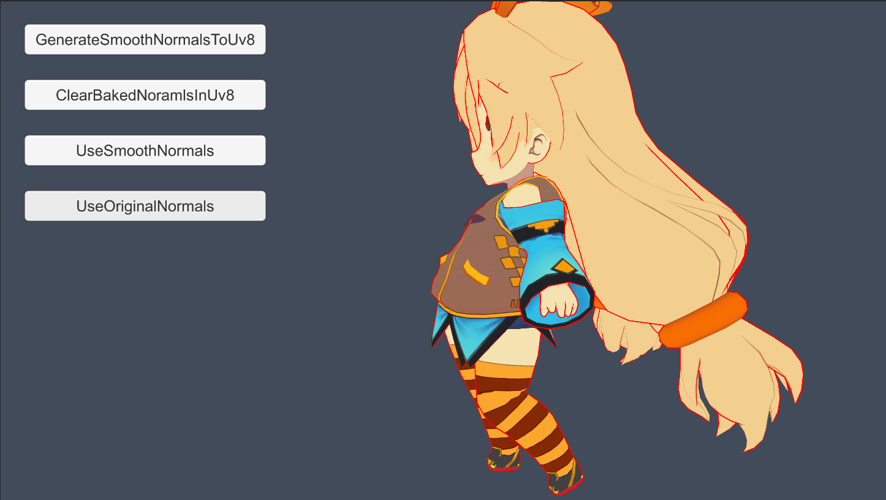

SmoothedNormals


OriginNormals:

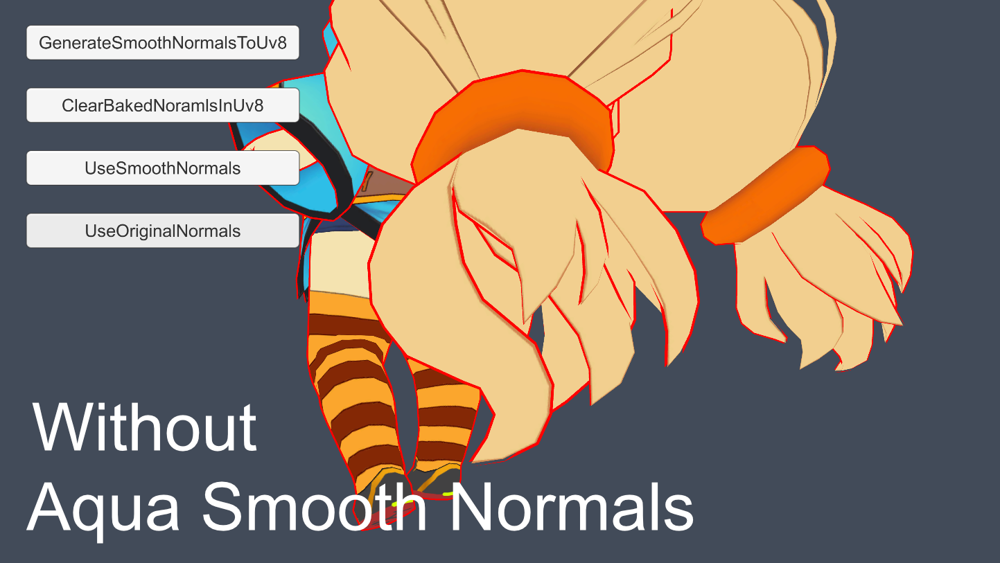

SmoothedNormals

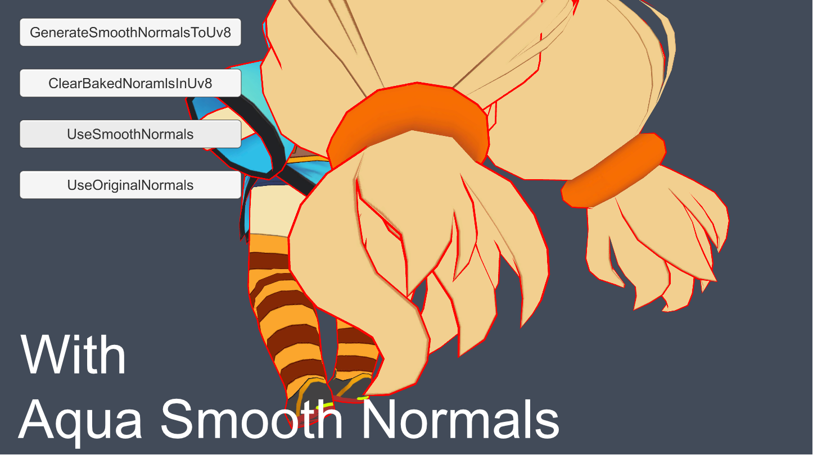

The model uses [Unity-Chan © Unity Technologies Japan/UCL](https://unity-chan.com/contents/guideline) 

